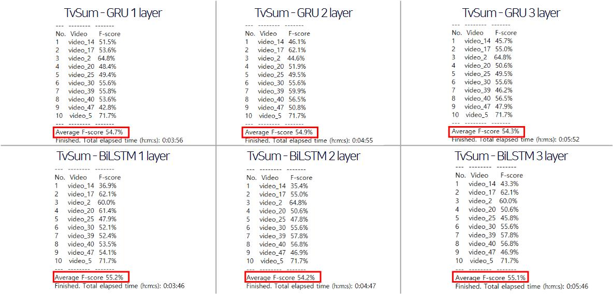

# Video-Summarization (Capstone Design 2021-1)
소프트웨어융합학과 옥수빈

## Overview
&nbsp;&nbsp;비디오 촬영 및 업로드가 간편해지고 특히 YouTube가 크게 성장하면서, 비디오 데이터의 생산량이 급격하게 증가하고 있다. 이러한 방대한 데이터 중에서 원하는 정보만을 효율적으로 다루기 위해서 비디오 영상의 요약 기술이 필요하다. 이번 캡스톤 디자인 수업에서는 LSTM 모델을 기반으로 하는 비디오의 요약 모델을 구현할 것이다. 구현 모델은 주어진 비디오 영상에서 중요한 부분만을 요약하여 보여줄 수 있도록 한다. 요약이 필요한 비디오를 입력함으로써 필요한 부분의 영상을 볼 수 있도록 하며, 요약 영상을 통해서 원본 영상의 전체적인 내용도 알 수 있도록 한다.   
&nbsp;&nbsp;“Video Summarization with Long Short-term Memory[1]” 논문을 참고하였는데, 본 논문에서는 dppLSTM이라는 모델을 제안하는데 이는 2개의 LSTM 레이어로 구성된 vsLSTM (본 논문에서 제안하는 또 다른 모델)과 DPP (Determinantal Point Processes)를 결합한 모델이다. 여기서 제안하는 두 모델 (vsLSTM과 dppLSTM)의 성능을 평가하기 위해서는 SumMe, TVSum 데이터셋을 사용하였고, 다른 모델인 MLP와 vsLSTM의 성능을 비교한 후, vsLSTM과 dppLSTM의 성능을 비교하는 과정을 거친다. 그 결과로 MLP보다 vsLSTM이 대부분의 경우에 좋은 성능을 보였고, vsLSTM보다 dppLSTM이 더 좋은 성능을 보였다. 이 점을 참고하여 과제를 수행해보려고 한다.

## 1. Model 설계
&nbsp;&nbsp;참고한 모델의 전반적인 구조는 [그림 1]과 같다. 크게 1) CNN, 2) RNN, 3) Reward 계산으로 구성된다.  
 
[그림 1] 모델의 구조    

**1.1 CNN** 
&nbsp;&nbsp;ImageNet에 pretrain된 GoogLeNet 모델을 사용하였다.

**1.2 RNN** 
&nbsp;&nbsp;BiLSTM과 GRU 모델에 대한 실험을 진행하였다. 
 
[그림 2] SumMe dataset에 BiLSTM, GRU 모델을 적용한 결과. 각각 layer를 1 ~ 3개로 설정하여 그 성능을 비교함  
 
[그림 3] TvSum dataset에 BiLSTM, GRU 모델을 적용한 결과. 각각 layer를 1 ~ 3개로 설정하여 그 성능을 비교함  
 
[그림 4] SumMe, TvSum dataset에 BiLSTM 모델을 적용한 결과. 각각 layer 수에 변화를 주며 그 성능을 비교함.   

그림 2 ~ 4를 통해서 layer의 수의 변화에 따른 모델의 성능에 규칙성이 없음을 알 수 있다. 위 실험 결과를 통해 본 프로젝트를 진행할 때 'BiLSTM 1layer' 구조를 사용하기로 결정한다. 
  
**1.3 Reward 계산** 
&nbsp;&nbsp;참고 논문에서 제안하는 reward의 계산 방식을 사용하였다. 해당 논문에서는 다음의 2가지 reward를 각각 계산하여 합하는 방식을 사용한다 : 1) 영상의 다양성 : 각 프레임별 dissimilarity 계산을 통해 다양성 확인, 2) 대표성 : 원본 영상을 얼마나 잘 표현하는가에 대한 계산. 자세한 계산 방식은 논문을 통해 확인 가능하다.

## 2. Model 구현
&nbsp;&nbsp;참고 논문에서 제공하는 소스코드의 대부분을 사용하고 결과 제작을 위해 그래프 생성 코드나 영상을 프레임으로 분할하는 코드 등을 추가로 제작하였다. 향후 계획은 참고 논문의 pretrained CNN과 RNN 부분의 모델을 수정하고, reward 계산 방식 역시 수정해보는 것이다.

## 3. Result
# 1) F-Score
F-Score에 대한 결과는 그림 2 ~ 4를 통해서 확인할 수 있다. 

# 2) Frame Graph
Frame Graph는 원본 영상의 각 프레임(회색) 중에서 선택된 프레임(빨간색)이 어떤 것인지 그래프로 나타낸 것이다. 결과 확인을 위해 SumMe의 Video_5에 대한 Graph를 확인해보도록 한다. 
 
[그림 5] SumMe의 Video_5에 대한 Frame Graph  

# 3) 요약 영상 
&nbsp;&nbsp;용량의 문제로 아래의 사이트에 업로드할 예정이다.

## 4. conclusion  
&nbsp;&nbsp;비디오 요약 모델은 여러 분야에서 활용될 수 있으며, 현재도 많이 활용되고 있다. 방대한 비디오 데이터 속에서 자신이 원하는 정보를 더 빠르고 더 쉽게 찾을 수 있도록 하기 위해 비디오 요약 기술은 매우 효과적일 것이다. 이는 전체 비디오를 보지 않고 요약된 비디오만을 시청함으로써 비디오의 전반적인 내용은 이해하면서 시청 시간은 많이 줄어들도록 해주기 때문이다. &nbsp;&nbsp;이번 캡스톤디자인 수업을 통해 실시한 프로젝트의 주요 내용은 강화 학습에 대한 스터디, 참고 논문 및 소스 코드에 대한 스터디였다. 모델 또는 파라미터 수정을 통해 모델의 성능을 향상시킴으로써 새로운 모델을 제안하려는 계획보다 다소 부족한 결과였다. 이는 졸업논문 작성 전에 실시를 완료할 예정이다.

## 5. 시연 동영상
&nbsp;&nbsp;용량의 문제로 아래의 사이트에 업로드할 예정이다.

## 참고문헌
[1] Zhang, K., Chao, W. L., Sha, F., & Grauman, K. (2016, October). Video summarization with long short-term memory. In European conference on computer vision (pp. 766-782). Springer, Cham.
